title: 使用github+Hexo人人都能拥有一个博客
date: 2015-11-26 13:27:40
toc: true
tags: Hexo
categories: 实用技能
---

 **我相信很多人都想拥有一个自己的博客，把自己的一些生活感想或者学习总结写到这上面分享给大家。首先我推荐一个网站[简书](http://www.jianshu.com)，无论你是否是搞技术开发工作的或者其他文艺工作者，只要你想写文章，简书无疑是一个好的写文章的地方，如果是搞技术的小伙伴还有推荐的是[博客园](http://www.cnblogs.com)，[CSDN博客](http://blog.csdn.net)等等**

<!--more-->

**但是如果你不满足那些博客千篇一律的外表，自己动手能力也强，想要拥有一个高大上的属于自己的博客，有自己的网址，那么跟我一起来创建一个属于自己的博客吧**


我的博客地址(http://www.codertian.com)

**关于使用github创建博客，知乎上有很多讨论，大家可以根据自己的爱好，搜索不同的教程。**
[有哪些github pages开源项目可以用来建博客？](http://www.zhihu.com/question/21169368)

我创建的这个博客是使用的github page + Hexo方法。

## 关于github page

使用github创建的博客是属于静态网站博客，也就是把写好的文章生成HTML网页，然后上传到github网站，显示的也就是HTML网页，所以加载速度会很快

*友情提示：创建自己的博客用到很多命令行命令，但是不要恐惧，你可以直接复制粘贴，不需要看的懂。*

# 开始搭建属于自己的博客吧

**大概分为下面几个步骤**

* 环境搭建
* 安装配置Hexo
* 配置github仓库
*  配置自己的网址（也叫域名）
*  创建和发布文章

# ①环境搭建

* 安装git （因为要给github上传文章）
* 安装Node.js（因为Hexo是基于Node.js开发的）

### 安装git

git官网(http://git-scm.com)

* Windows: 直接下载和安装
* Mac：进入git网站下载和安装，或者进入[这里](http://sourceforge.net/projects/git-osx-installer/)下载
* Ubuntu：打开终端复制粘贴命令 ``sudo apt-get install git-core``

### 安装Node.js

进入官网(https://nodejs.org/en/)
下载安装包，直接点击安装就可以了

# ②安装和配置Hexo

### 安装Hexo

**以下命令都是直接复制粘贴到电脑终点运行的**

上面的环境配置成功以后就可以使用npm安装Hexo了

```
npm install -g hexo-cli
```
然后在本地目录创建一个文件夹,比如我创建的是一个Hexo文件夹

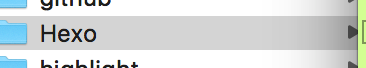

然后cd到Hexo文件夹，也就是进去这个文件夹

然后依次执行下面的命令

```
hexo init
npm install
```
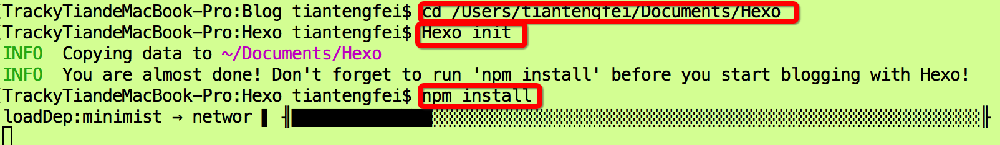

如果出现很多串代码的话，没有什么明显的错误就表示安装成功。

结果就是Hexo文件夹下面是这种结构

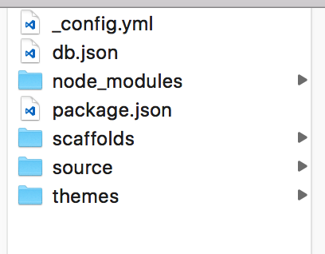

然后启动本地这个Hexo服务

```
hexo server
```

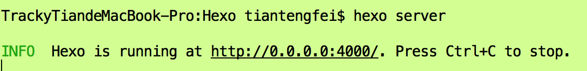

然后打开浏览器，输入http://0.0.0.0:4000/   出现下图，既证明Hexo安装成功

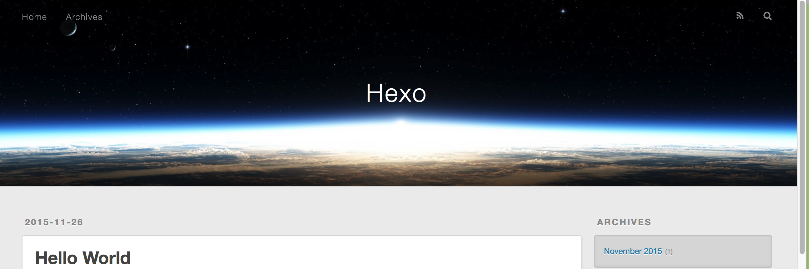

### 更改主题

**好的，显示的网站你可能看着不好看，现在我们更改一下主题**

按ctrl+c关闭server

我博客使用的主题是(https://github.com/litten/hexo-theme-yilia)

打开终端窗口，输入一下命令，将目录切换到Hexo文件夹内的themes文件夹内

```
cd themes
```

然后把这个主题从github网站上clone下来

```
git clone https://github.com/litten/hexo-theme-yilia.git
```

等待克隆完成，你会在themes文件夹下看到新的主题包，如下图，将这个主题包重命名为yilla

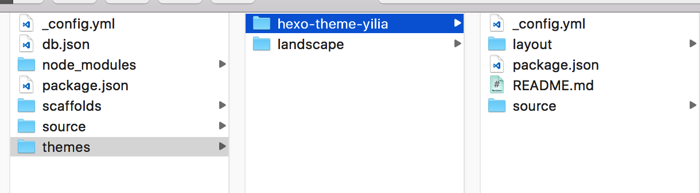


然后打开Hexo文件夹下面的``_config.yml``文件，修改里面的``theme``为yilia

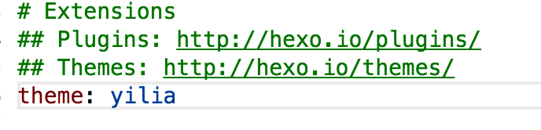


重新打开server，浏览器输入http://0.0.0.0:4000/   是不是看到主题已经变了？？

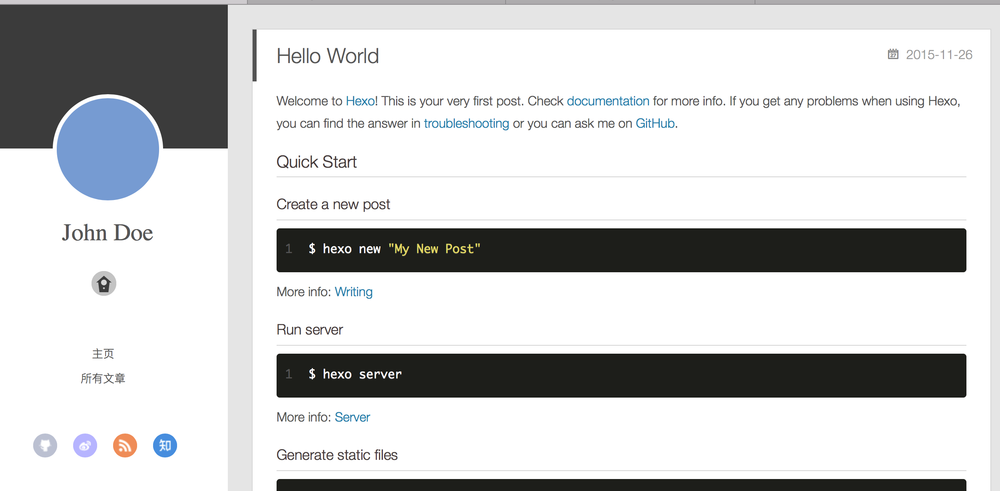

好了，到此为止我们已经完成了本地Hexo的安装和配置。


# ③配置github仓库

github官网(http://www.github.com)

注册账号我就不用说了吧，都很简单,然后创建一个的放博客文章的仓库

点击Crete a repositor


下图箭头指的方向就是配置你博客的访问地址，也就是仓库名 ``用户名.github.io ``必须是这个结构，不能有一点偏差。就按照我的方式创建就行，只需要把用户名改为你的
然后点击创建，会初始化一个空的仓库（因为我已经有一个这样的仓库了，所以会有红色警告）


### 配置SSH

**然后就是配置SSH**

我测试的是：

* 如果你电脑上以前用过git往github上传过代码，并且配置的用户名和你github账号一致，那么你的github就算没有设置SSH，也可以上传成功，只需要把Hexo的配置文件配置为HTTP方式上传文章。
* 如果你配置上传的账号和github账号不同，那么你可以把这个账号添加到你博客仓库的Collaborators上面，也可以上传文章
 
 如果你不懂上面说的啥意思，不用管那么多，那就老老实实配置SSH吧！！

简单方法：

去这个网站下载github的客户端(https://desktop.github.com)  然后输入你的用户名，会自动配置好SSH

命令行方法：

执行下面命令生成SSH

```
ssh-keygen
```
敲三次回车，既可以生成``id_rsa.pub``文件，这里面就是SSH key的内容

然后使用vim编辑器打开这个文件

```
vim ~/.ssh/id_rsa.pub
```
然后使用鼠标拷贝里面的内容（退出vim编辑器命令``:wq``）

打开你的github,点击Setting

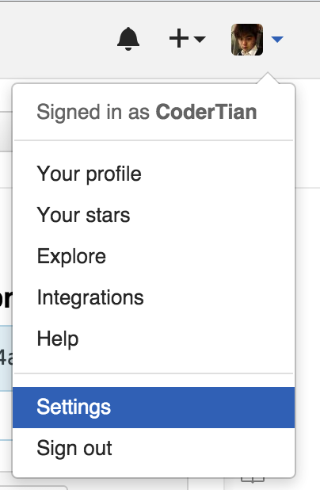

点击左边SSH keys

点击右边Add SSH

然后把复制的内容粘贴到下面那个框里面，title随便自己写。

过程可能会让你输入一次密码，输入即可！
配置好就行了

判断SSH是否配置好

```
ssh -T git@github.com
```
出现``Hi CoderTian! You've successfully authenticated, but GitHub does not provide shell access.`` 就表示你已经配置好了SSH

### 配置本地Hexo

**SSH配置好了，下面配置你的本地Hexo**

打开Hexo目录下的``_config.yml``，拉倒最下面
配置为这样子,只需要把codertian改为你自己的github用户名就可以了。
*这种提交方式是使用http方式提交的，我个人测试的是不需要配置SSH也可以提交*

*下面的配置大家要注意空格，复制我的更改即可，注意路径一定要是https的，http会报错*

```
# Deployment
## Docs: http://hexo.io/docs/deployment.html
deploy:
  type: git
  repository: https://github.com/codertian/codertian.github.io.git
  branch: master
  ```
  保存，``cd``到Hexo的根目录
  依次执行下面的命令
  
  ```
  hexo clean
  hexo g
  hexo d
  ```
  如果出现下图既证明已经没有出现问题
  
  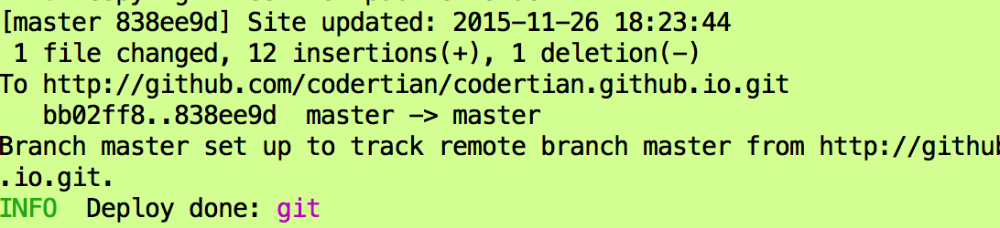
  
  如果出现失败的提示可以把上面的配置改为下面这种使用SSH方式的提交，把用户名改为你自己的用户名
  
  
  
  ```
# Deployment
## Docs: http://hexo.io/docs/deployment.html
deploy:
  type: git
  repository: git@github.com:codertian/codertian.github.io.git
  branch: master
  ```

第一次上传可能会让你输入git的用户名和密码

如果成功的话在浏览器输入(http://codertian.github.io)  就可以访问你的博客了。把用户名换为你自己的。

**好了，到这里为止，你已经完成了自己博客的创建了**

# ④配置博客的域名

首先去万网(http://wanwang.aliyun.com)  购买自己的域名，比如我购买的是（codertian.com）

然后去github，点击进去你创建的那个博客仓库点击``create a new file here``


名字为``CNAME``
内容为``www.codertian.com``记住填写你自己申请的域名

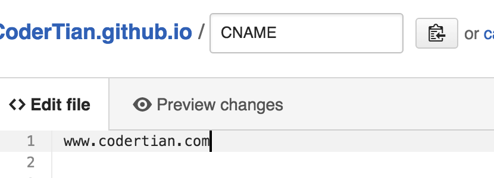

然后提交

来到仓库的右边点击``Download zip``按钮，下载下来这个仓库，把里面的``CNAME``文件拖到``Hexo``文件的``Source``目录下


这边配置好了以后，来到万网解析你的域名
配置为这样子

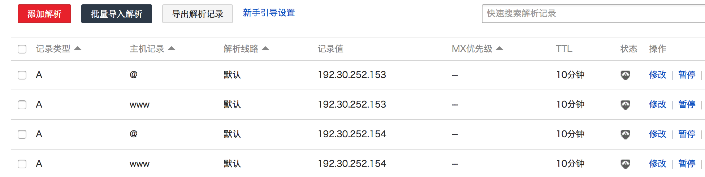

github提供了两个主机地址

```
192.30.252.153
192.30.252.154
```

好了等待你的域名解析生效吧。就可以在浏览器里面输入你自己的域名访问的博客了。

# ⑤创建和发布文章

想要发布新的文章，首先创建
cd到Hexo文件夹

```
hexo new "文章标题"
```
你可以在Hexo->Source->_post目录下看到你新创建的那个文章，还有一个配套的文件夹，里面放这边博文的图片资源

使用支持MarkDown编辑器编写的打开新创建的文件，就可以写文章了，要根据MarkDown语法写出来的文章才会好看

**创建草稿**

```
hexo new draft ”file name"
```

**发布草稿**、
```
hexo publish "file name"
```

**Mac的markdown编辑器，我推荐mou**
**window下面的大家可以自行搜索一下**

markdown具体语法参考(http://www.appinn.com/markdown/#code)

**文章标题，日期，标签，分类**

```
title: MVVM模式快速入门
date: 2015-11-13 15:40:25
toc: true
tags: MVVM
categories: IOS开发
```

如果每次添加分类太麻烦，可以修改一下模板，在``/Hexo/scaffolds``下面的``post.md``文件

文章写好直接执行下面命令即可直接发布文章

```
hexo d -g
```

### 关于文章图片的插入

这个有必要说一下怎么做  
文章插入图片需要用到Hexo的一个插件，首先cd到hexo的根目录

```
npm install https://github.com/CodeFalling/hexo-asset-image --save
```

然后把图片放入对应文章的配套文件夹下，比如1.png

```

```

**如果你是写代码的，感觉代码样式不好看，你可以下载别的主题，替换代码显示样式文件**

文件地址``/source/css/_partial/highlight.styl``

另外如果要给博客添加计数功能参考(http://ibruce.info/)


