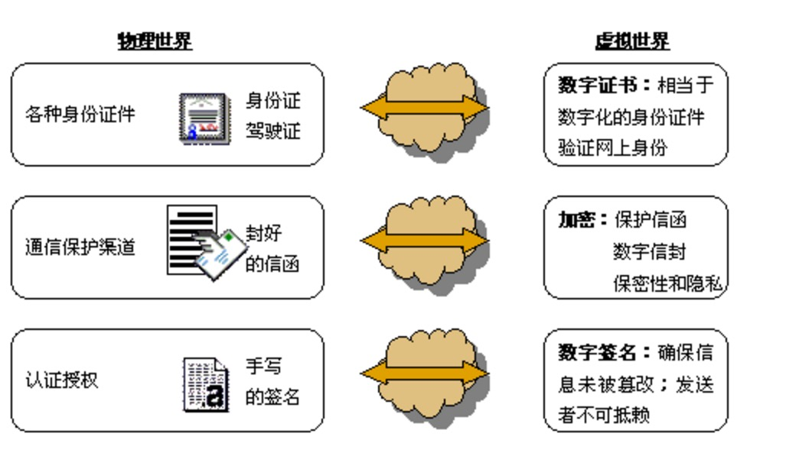

title: 文件安全简述
toc: true
author: moexcept
date: 2016-03-02 14:53:39
tags: 安全
categories: iOS开发
---

**关于安全问题一直以来都是每个程序员要关注的，目前各种加密算法，总之没有绝对的安全。可惜大学学的知识早就还给老师了，最近也是需要加密一些东西于是重新了解到一些关于安全的知识。记录和分享一下。**

<!--more-->

# 加密方式
### 对称性加密

对称性加密就是加密使用的秘钥和解密使用的密钥是同一个密钥，比如我给一段文字``I love you``加密使用的密钥是``abc``，加密得到的文字是``fyduibjbndikdfoiwer``(随便写的)，那么解密的时候我们在使用``abc``解密，得到文字``I love you``，这就是对称性加密，就一个密钥。

### 非对称加密

非对称加密和对称加密差不多，不过非对称加密有两个密钥，公钥和私钥。一个用于加密一个用于解密，公钥和私钥都可以用于加密，只是用途不一样。别人知道你的公钥但不知道你的私钥，私钥只有你自己知道。比如``I Love you``使用公钥加密后哦为``odshgbbhkdbnbyh``，然后使用私钥解密得到``I love you``。

### 数字摘要

信息传输过程中有可能会出现信息被更改，信息不完整，为了确定信息的完整性，会对信息进行哈希运算，生成一个值``例如SHA1值``，接收者收到信息的摘要值和传输前不一致就表示信息被更改了。

### 数字签名

数字签名就是``非对称加密``和``数字摘要``结合的产物，保证了信息来源的可靠性。
例如``A``要给``B``发消息，A对消息生成摘要值，然后把摘要值使用``A``的私钥加密后随着消息一起发送给``B``，B收到消息以后，先算消息的摘要值，然后使用A的公钥解密A加密的摘要值（能解出就表示消息是A发的），得出的结果如果和B算出的摘要值一致就表示信息在传输过程中没有被篡改。

### 数字证书

现实生活中我们有身份证来证明自己的身份，但是在网络世界中我们用什么证明自己的身份啊，那就是数字证书。``通俗讲数字证书就是我们网络世界的身份证。``数字证书包含信息加密，数字签名，它主要包含证书所有者的信息、证书所有者的公开密钥和证书颁发机构的签名等内容。

盗用网上一个图

#### CA认证机构

说道数字证书就要提及一下CA（Certificate Authority）认证机构，就类似于我们现实生活中证件的颁发机构。

#### HTTP和HTTPS

HTTP方式和HTTPS是完全不同的连接方式，用的端口也不一样，HTTP是80端口，HTTPS是443端口。  
HTTP是超文本传输协议，是明文传输，HTTPS是使用加密传输的
HTTPS传输是HTTP+SSL传输，需要用到数字证书，保证了文件传输的安全性。要比HTTP安全。

### 推荐使用的加密方式

iOS开发中我们需要从网络上下载服务器上的东西，怎么保证这个东西是安全没被更改过的呢，我使用的方式

* 服务器端使用rsa对文件进行公钥加密
* 传输我们使用HTTPS方式，保证文件的安全和未被篡改
* app端的公钥不要直接存储，首先使用AES进行一次对称性加密，然后存储加密后的字符串
* 如果还感觉不安全，再使用[cocoapods-keys](https://github.com/orta/cocoapods-keys)再对加密后的字符串进行加密存储
* 下载好文件，使用AES解密出私钥，然后使用私钥解密文件，就能保证这一次的传输安全。

